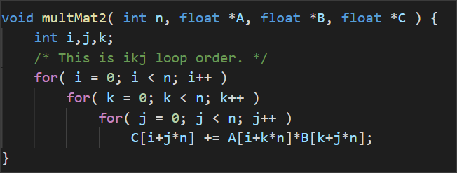

## Exercise 1:

### Scenario 1:

1. What combination of parameters is producing the hit rate you observe? (Hint: Your answer should be the process of your calculation.)

   - hit rate=0. For this instance, the stepsize is 8 words, and the #blocks is 4, block size is 2 words. So when the *stepwise(words)* is a multiple of *block size(words) \* #blocks*, we will repeatedly evict the first block and get a cache miss.
2. What is our hit rate if we increase Rep Count arbitrarily? Why?

   - still 0. Because whatever the rep count is, we will only use the first block and repeatedly get a miss due to the above relation. (Unless we just only access the first word and increase rep count, then the hit rate will increas in this trival situation).

3. How could we modify our program parameters to maximize our hit rate?

   - set the stepsize to 1(word), then we get the max hit rate of 0.5.

   

### Scenario 2:

1. What combination of parameters is producing the hit rate you observe? (Hint: Your answer should be the process of your calculation.)

   1. Hit rate=0.75	size=256, go through once, block size=16, 256/16=16, so 16 times load block, Compulsory miss=16

      times of word loop=32, each loop need to read and write, 32*2=64, so accesses 64 times

      cache can exactly be filled with all data it needed (cache size=256)

   

2. What happens to our hit rate as Rep Count goes to infinity? Why?

   1. 1, since cache can exactly be filled with all data it needed, and compulsory miss will be ignore

3. Suppose we have a program that uses a very large array and during each Rep, we apply a different operator to the elements of our array (e.g. if Rep Count = 1024, we apply 1024 different operations to each of the array elements). How can we restructure our program to achieve a hit rate like that achieved in this scenario? (Assume that the number of operations we apply to each element is very large and that the result for each element can be computed independently of the other elements.) What is this technique called?

   1. Cache Blocking Techniques

   2. 

      之前是对于每一个body1，我把所有body2算一遍。现在是对于每一个body1，我先把body2分成、比如、10份，先把第一份body2全部算一遍，再对于每个body1，把第二份body2都算一遍。划分得当的话，每一份body2可以全部被存在cache里，对于每个body1算的时候，都是hit的。否则，全部过一遍body2的话，下一个循环开头用到的body2又被flush掉了。

   3. 程序改法：还没想，暂时先跳过，不过和上面的程序差不多，尽量划分成block，一次把整个block都算完

### Scenario 3:

1. Run the simulation a few times. Every time, set a different seed value (bottom of the cache window). Note that the hit rate is non-deterministic. What is the range of its hit rate? Why is this the case? ("The cache eviction is random" is not a sufficient answer)
     1. Five experiments: 0.3125，0.25，0.1875，0.4375，0.375，so the range is approximately between 0.1875-0.4375，and theoretically range is between 0 (always flush one block resulting miss every time)-0.5 (the same as LRU)
     2. 这里的random应该是cache就算还没满，也是随便找一个flush掉，所以会出现cache还没满但是把有数据的cache给flush掉的情况——待确认？

2. Which Cache parameter can you modify in order to get a constant hit rate? Record the parameter and its value (and be prepared to show your TA a few runs of the simulation). How does this parameter allow us to get a constant hit rate? And explain why the constant hit rate value is that value.
     1. We can modify random to LRU, and hit rate is 0.5——the first loop is compulsory miss, and the second loop is a all-hit loop.

## Exercise 2:

​	Remark: it can be viewed as a flatten mat, for C, i is row and j is col

1. Which ordering(s) perform best for 1000-by-1000 matrices?
   1. jki
2. Which ordering(s) perform the worst?
   1. ikj
3. How does the way we stride through the matrices with respect to the innermost loop affect performance?
   1. 理论上，C矩阵的每一个元素，来自A的一行和B的一列相乘。所以最高效的方法应该是对于A的一行(或者B的一列)，遍历B的所有列(或者A的所有行)，算出C的某一行(或者某一列)。这样的话，A的那一行(或者B的一列)可以一直存在cache里，直到这个矩阵相乘里，针对它的操作全部结束。
   2. 但是这里使用c语言的一维数组实现的，相当于被flatten了的matrix。如下图ikj是最慢的，因为fix i之后，遍历j，第一次j=0，第二次j=1，C差了1000，相邻的元素不在同一个cache block里，每次都会miss都要重新读取。反之，对于jki的话，最内层遍历i，C每次差1，相邻元素在同一个cache block里，可以大幅增加hit的次数。其它的同理。

## Exercise 3:

我觉得这里block加速的本质是spatial locality，就是每次miss的时候会读一整条cache line进来，分block操作就可以把一次把整条cache line对应的数据都操作完，增加数据的利用率

​	每次miss的时候，读数据是读一条cache line进来，分block操作就可以把一次把整条cache line对应的数据都操作完，增加数据的利用率

1. 
   1. 在n=100时没差别，可能是因为这时候本身就可以把整个matrix读到cache里，怎么操作都没区别
   2. 之后的话，当n=1000及以上时，就能看出区别了。这时候block就能最大化spatial locality

2. 
   1. 这边block size=100时效率最高，可能因为cache的容量正好在100附近，正好一次都读进来然后操作完。
   2. block size太小会导致内两层循环太少，还没操作完cache里所有数据就换到下一个block了，没法最大化spatial locality。block size太大会导致外两层循环次数太少，每个block内反复flush cache，有些数据还没完全用完就被flush掉了，也没最大化spatial locality。

